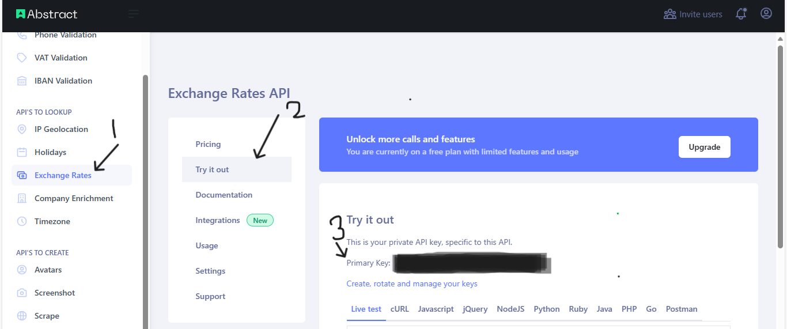

import { Steps, Aside } from "@astrojs/starlight/components";

[Abstract API](https://www.abstractapi.com/) provides a single api-key per API. [Create an account](https://app.abstractapi.com/users/signup) to retrieve your api-keys from the dashboard.

## How to get an api-key



Locate the api-key for an API through the steps below:

<Steps>

1. Hover around the left corner of your dashboard

2. Select an API from the list

3. An api-key for the selected API will be displayed on the new page. For example: `Primary key: "6f2e9012d48f4e0bac70283244ade5e4"`.

</Steps>

<Aside>The above api-key is invalid.</Aside>

## How to use an api-key

Each module in `abstract-python` requires an api-key to send queries. The key must belong to
the API you intend to use. Below is a snippet on how to use an api-key:

```python
from abstract_python import VatAPI

vat_api_key = "your_unique_vat_api_key"

vatapi = VatAPI(vat_api_key)
```

You can begin to call the methods available for the authenticated class.
