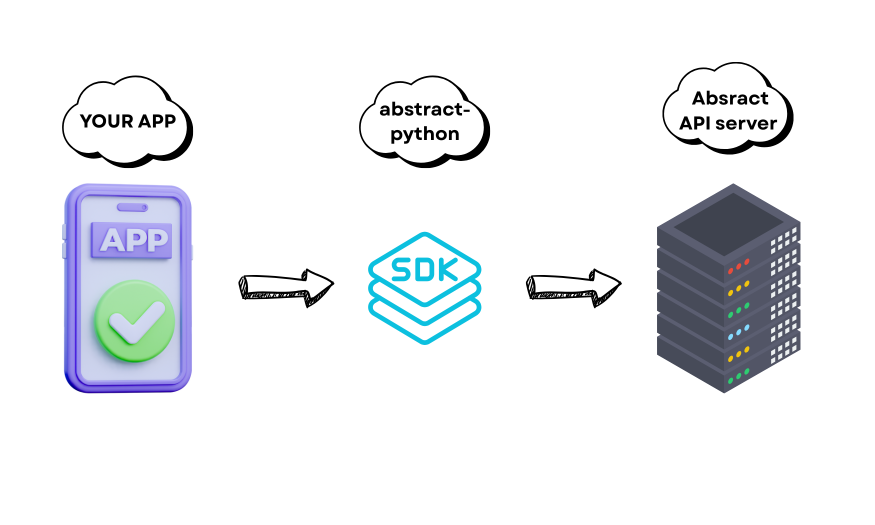

import { Steps, Aside } from "@astrojs/starlight/components";



The `abstract-python` library is a Python SDK for APIs by [AbstractAPI](https://www.abstractapi.com/). It has helper classes
that lets Python developers integrate these APIs in their apps.

It also does type validation on each request data before they're sent to Abstract's server. This helps to manage credits as each request whether successful or otherwise costs a credit.

This SDK currrently supports the following APIs:

- **[Exchange Rates API](https://docs.abstractapi.com/exchange-rates)**
- **[IP Geolocation API](https://docs.abstractapi.com/ip-geolocation)**
- **[VAT API](https://docs.abstractapi.com/vat-validation)**.

<Aside>
  This isn't an official SDK by AbstractAPI but safe to use by anyone.
</Aside>

## Installation

Follow the steps below to install `abstract-python`:

<Steps>

1. **Create a virtual environment:**

   Run the command below in your terminal to create a virtual environment

   ```bash
   virtualenv env
   ```

2. **Activate the virtual environment**:

   _Windows - using command prompt:_

   ```bash
   .\env\Scripts\activate\
   ```

   _Unix/macOS using bash:_

   ```bash
   source ./env/bin/activate
   ```

3. Run the command below to install `abstract-python`:

   ```bash
   pip install abstract-python
   ```

</Steps>

## Example usage

If your app uses two or more of the supported APIs, it's recommended to import the SDK as seen below:

```python
from abstract_python import *

vatAPI = VatAPI()
```

Use the following format for single API usage:

```python
from abstract_python import VatAPI

vatAPI = VatAPI()
```
